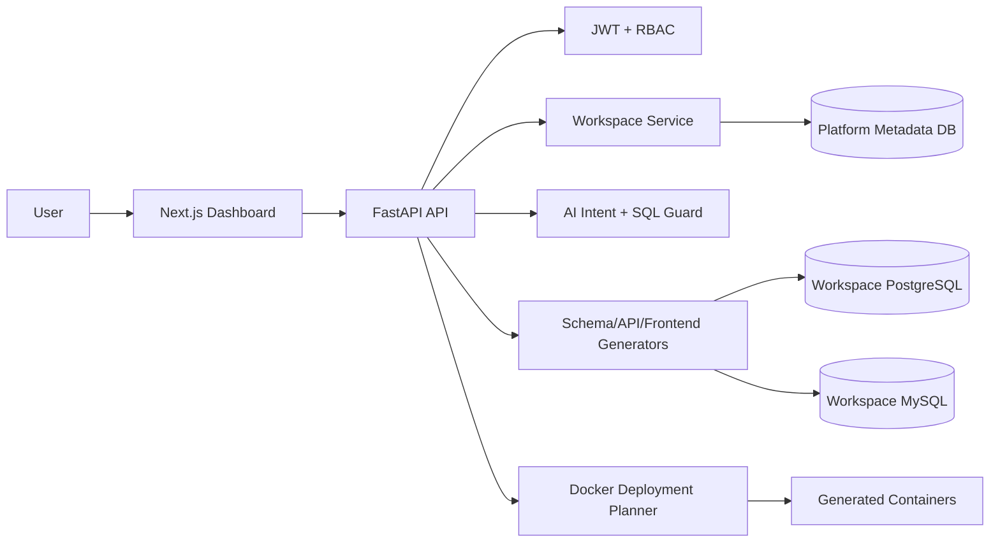

# Architecture

## Backend Modules

- `api`: HTTP route boundaries and dependencies.
- `core`: settings, database session, security helpers.
- `models`: SQLAlchemy metadata models for users, workspaces, schemas, and deployments.
- `schemas`: Pydantic request and response contracts.
- `ai`: intent parsing and SQL safety guardrails.
- `generators`: database DDL and future API/frontend code generation.
- `deployment`: Docker and reverse-proxy planning.

## Tenant Isolation Model

Each workspace stores its own database URL and deployment manifest. The next phase should provision a physical database or schema per workspace and write generated deployment files into `deployments/{workspace_slug}`.
